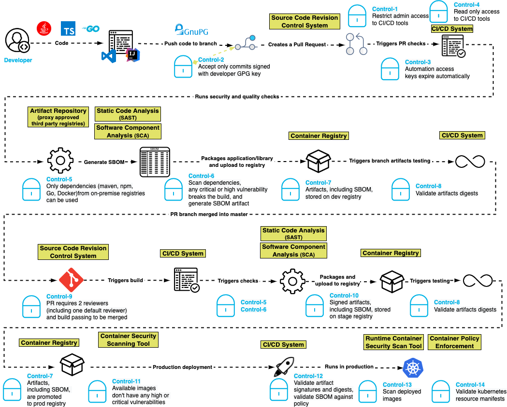

# Blueprint for building modern, secure software development pipelines

_For engineers and security teams driving fast and secure software supply chains_

This document was authored by Veracode and Venafi with the goal of defining a vendor-neutral map of standard controls. We welcome contributions to the standard.

>**EDITORIAL MILESTONES (remove on _Publish_)**
>- [x] Convert and publish to private GitHub repo (17 May 2021)
>- [ ] Final Draft (_## May 2021_)
>- [ ] Publish to Live (28 May 2021)

## Audience + outcome

This Blueprint has been created by engineers for engineering leaders, architects and product security engineers. The design of this Blueprint places a priority on speed and agility of modern software development that provides businesses with a competitive advantage while incorporating a security always mindset.

We propose a standard set of controls to secure the software development pipeline for continuous integration and continuous deployment (CI/CD) against attack. The goal is to minimize the possibility of a supply chain attack such as the one trojanizing SolarWinds Orion software updates,the Codecov Bash Uploader attack or the even more recent Passwordstate password manager compromise, by ensuring that authentication and authorization is properly managed throughout the pipeline, the integrity of software artifacts are tested at appropriate stages, and controls are placed on third party and open source software incorporated into the software.

The outcome of adopting the Blueprint is delivery of assured software at lower risk of supply chain tampering, attack during development, and manipulation in staging and production. The Blueprint gives engineering teams an actionable architecture that security teams will get behind and support.

## Situation

### Speed + agility

Engineers are the competitive advantage. The speed and agility built on opensource, cloud native design, multi-cloud architectures, and CI/CD pipelines are the ingredients for success.

### Attack on software development

Attacks are changing. Attackers are developers who have grown up with an opensource, cloud native mindset. Most of the focus of security in the last few years has been on infrastructure and as everything has become software defined, attackers have moved to attack surfaces that are less secure and less well understood by traditional security teams. They are shifting left to target developers and supply chain to yield more successful outcomes, whether highly targeted or wide ranging in impact. Security teams and controls will therefore be forever playing catchup.

## Design philosophy

The Blueprint is designed to engineer out the attacker so developers and their automated pipelines move fast from idea to production. Engineering teams must be responsible for the design and implementation while giving security teams the visibility and confirmation that controls are operational and policies are being enforced. This means engineering teams can use their preferred pipeline tools and consume their organization’s preferred cybersecurity services without being impeded by controls instituted by enterprise security.

We base our approach on the following design philosophy:  

- _Least Privilege_ - grant only the access and permissions required to accomplish a job, and no more.

- _Immutability_ - Artifacts and infrastructure are not modified after deployment to an environment. If a change is required, it is done in the image or script in the development environment and then promoted through the higher environments.

- _Everything as Code_ - Not only software artifacts, but infrastructure, security policies, and other parts of the pipeline are implemented as code and subject to the same controls as the software artifacts.

- _Traceability_ – All changes whether to infrastructure or business code is revision controlled. This principle works hand in hand with Everything as Code.

 The design is pragmatic. Security controls will not be implemented or will be routed around if they prove an impediment to the timely delivery of new software. The Blueprint is developer friendly and low friction that improves the quality and assurance of the software that runs the modern world.

## Blueprint for speed, agility and assurance

The blueprint for engineered assured software is designed on 4 stages of software development pipelines:

1. _Code_: developers design software and commit code to code repositories  

1. _Collaborate_: developers include external and internal libraries and share software for review  

1. _Staging_: software is built and prepared for final delivery  

1. _Production_: software is run anywhere

### Blueprint in action

The Blueprint is built to fit modern development pipelines where developers, pipelines, and execution can be anywhere in the world.

#### Control-1: Restrict administrative access to CI/CD tools

It is important to ensure that only authorized persons may make administrative changes to the CI/CD system. If an unauthorized person is able to gain access, changes to pipeline definitions enable the subversion of many of the remaining controls in this document.

Both host and application-layer access to CI/CD tools should be protected with multi-factor authentication.

> :skull: 
> Instead of manipulating code, attackers will seek to control the CI/CD pipeline itself. This can enable both breach without detection and long-term impact far greater than manipulating code. Attackers seek to introduce new pipelines inserting malicious code or modify pipelines that introduce controls like code signing.

#### Control-2: Accept only commits signed with developer GPG key

Unsigned code commits are challenging if not impossible to trace and pose a risk to the integrity of the code base. Requiring commits to be signed with a developer GPG key helps to ensure nonrepudiation of commits and increases the burden on the attacker seeking to insert malicious code.

> :skull: 
> An easy win for attackers can be to infect developers’ machines or steal credentials that give access. Attackers can then manipulate code or inject new malicious code as they please.

#### Control-3: Automation access keys expire automatically

Ensuring that access keys used by automation periodically expire ensures a shorter window of attack should keys be compromised.

> :skull: 
> Automated build systems are a hacker’s dream: they are out of sight of humans and operate at machine speed. Attackers can either steal access keys or mint new ones through a series of attacks. These are especially hard to detect.

#### Control-4: Reduce automation access to read only

CI systems should only have read access to source code repositories following the principle of least privilege access.

> :skull: 
> Automated build processes are a hacker’s dream: they are out of sight of humans and operate at machine speed. Attackers can bypass usual source code review process to make changes to the source code that may be hard to detect.

#### Control-5: Only dependencies from trusted registries can be used

Modern software dependency managers, including npm, maven , Nuget, pip, and others, rely on declaring the dependencies required for the application and then fetching them at build time. By configuring the dependency manager to only allow connections to an authorized list of registries, these attacks can be blunted by keeping malicious packages in the public registries from entering the pipeline.

The trusted repository can also ensure that security policies are enforced on dependencies, for example ensuring that only dependencies that are free of critical or high vulnerabilities can be used. Implementing a control at the repository that throws an error when a component with known vulnerabilities is requested helps to reduce the chances of an attack against a known vulnerability downstream.

Teams should be aware of implicit runtime dependencies as well as explicit buildtime dependencies (see Control 14).

> :skull: 
> Attackers can quickly spread malicious code through dependencies.  Attackers may insert malicious code that is then incorporated the application’s manifest by stealing credentials en masse or sophisticated, targeted thefts.
> Hackers can also target mistakes and oversights through typo-squatting and dependency confusion. Adversaries go to great ends to publish packages under a trusted name or even with common typos so they are included in builds.
> All of the stakes are exponentially raised when public repositories are used.  

#### Control-6: Any critical or high severity vulnerability breaks the build

Supply chain attacks may introduce code with vulnerabilities into the software pipeline. Using static application security testing (SAST) helps to identify serious security issues, including poor cryptographic practices, hard-coded credentials, and injection vulnerabilities. Performing SAST in the pipeline and failing the pipeline on the discovery of a critical or high severity finding helps to minimize the chance of introduction of deliberately insecure code.

Likewise, software composition analysis (SCA) identifies software libraries with known vulnerabilities. The pipeline should fail if a library with a critical or high severity vulnerability is identified. Note that this control helps mitigate against a failure of Control-4.
Both SAST and SCA may identify weaknesses in software that are not true vulnerabilities. Selecting tools that allow setting a “baseline” of acceptable findings is a pragmatic step in ensuring successful adoption of this control.

This control should be applied at various stages of the pipeline, including IDE-integrated checks, when committing to a branch, at time of pull request, and at a merge request to the main branch. Early identification of vulnerabilities can reduce remediation cost.

_Additionally, this control would also need a defined and documented vulnerability exception management process to be in place._

> :skull: 
> Most often the result of unexpected consequences, vulnerabilities are a reality of developer life. Attackers too may contribute vulnerabilities that go unseen and undetected and can proliferate through a software supply chain quickly.

#### Control-7: Artifacts are stored in a repository in dev, stage and production

All artifacts should be stored in a repository at each stage of the build pipeline so that there is clear traceability between the test results and the actual artifact tested. This control also helps to enforce the immutability of the artifacts, such that we can compare artifacts in the development, staging and production repositories and ensure that we maintain a chain of control.

Repositories for dev, stage and production should be segregated so that role-based access control can ensure least privilege at each stage, and so that more stringent policies (e.g. artifact signing) can be enforced in higher environments.
Artifacts should be promoted from repository to repository in accordance with the principle of immutability.

#### Control-8: Validate artifact digest

Before an artifact is deployed in any environment its digest should be validated against the artifact in the repository to ensure that it has not been compromised.

> :skull: 
> At all times, attackers are attempting to infiltrate system and make modifications to code through any variety of means. Adversaries insert targeted attacks or common vulnerabilities to suit their needs unpredictable needs.

#### Control-9: Pull request requires two reviewers (including one default reviewer) and passing build to be merge

Requiring two code reviews at pull request, including one from a developer who is an _owner_ of that code. In addition to supporting good coding practices it also ensures that no commits can be made without competent human oversight. Requiring that all tests are passed ensures that the above controls are not circumvented.

> :skull: 
> At all times, attackers are attempting to infiltrate system and make modifications to code through any variety of means. Adversaries insert targeted attacks or common vulnerabilities to suit their needs unpredictable needs. It cannot be assumed that the adversary is in fact a member of your own team.

#### Control-10: Artifacts in higher repositories are signed

Requiring artifacts to be signed in a repository throughout the process ensures visibility and traceability for what is deployed to production. Requiring signed artifacts helps to ensure that untrusted binaries are not deployed to customer environments and allows validating the source of the binaries.

> :skull: 
> Through credential theft, vulnerability exploit, targeted attack or more, attackers succeed in insert their malicious code into pipeline and repositories. Code should be consider suspect and malicious.

#### Control-11: Available container images don’t have any high or critical vulnerabilities

Just as applications need to be tested for vulnerabilities before being placed in production, so do the container images into which they are packaged for deployment. Container images potentially have open-source vulnerabilities as long as they contain open-source software, for instance web application servers, networking libraries, and databases. Additionally, containers may have configuration vulnerabilities that allow attackers to have more access than they should to the resources that containers manage. Container images can be tested with a container security tool in the pipeline.

#### Control-12: Pull artifacts from internal registries only

>:exclamation: We agreed to replace this with a reference to Control 6

#### Control-13: Validate artifact signatures and digests

As part of deploying artifacts from the internal registry, validating the signature of the artifact against the digest ensures that the artifact was not tampered with in the repository and that the artifact being deployed is the same that was tested.

> :skull: 
> Through credential theft, vulnerability exploit, targeted attack or more, attackers succeed in insert their malicious code into pipeline and repositories. Code should be consider suspect and malicious.

#### Control-14: Scan deployed images in production

It is always a good idea to validate pre-production controls in production. This helps to ensure that the controls prior were followed for all software in production.

> :skull: 
> At all times, attackers are attempting to infiltrate system and make modifications to code through any variety of means. Adversaries insert targeted attacks or common vulnerabilities to suit their needs unpredictable needs. It cannot be assumed that the adversary is in fact a member of your own team.

#### Control-15: Validate Kubernetes resource manifests

The last line of defense is the container orchestration layer. Kubernetes is responsible for deploying the containers of the application into production, and if the resource manifests are tampered with may be tricked into deploying a container of the attacker’s choice. It is important to ensure that the Kubernetes resource manifests are controlled and validated just as the actual images are.

#### Control-16: Ensure build environments are ephemeral and immutable

Build environments should be defined in code with automated creation / teardown and a fresh environment created for every build. Build hosts should not be accessible via interactive login.

> :skull: 
> Attackers who gain access to build environments are able to bypass controls implemented earlier in the build pipeline. Ensuring build environments are themselves defined as code and live only for the duration of a build will prevent attackers persisting in build infrastructure.
 
## Appendix A

This appendix summarizes the controls, threats protected against, and critical services involved.

|       | Blueprint Node | Threat | Control | Critical Services 
| :---: | :---:  | :--- | :--- | :---  
| Code  | 1 | Attacker privilege escalation | Restrict admin access to CI/CD tools | Zero trust access  
|       | 2 | Attacker submits malicious code | Accept only commits signed with unique identities | Code signing 
|       | 3 | Attacker credential theft, escalation, or exploit to control CI/CD system | Automation access keys expires automatically | CI/CD policy control
|       | 4 | Attacker submits malicious code via CI/CD system | Automation read-only access to source code repo | CI/CD policy control 
| Collaboration | 5 | Vulnerability introduced from software supply chain | Only dependencies from trusted registries accepted | Enterprise artifact registry
|             | 6 | Vulnerability introduced from software supply chain | Vulnerability analysts rejects threats | Static Code Analysis Software Component Analysis 
|             | 7 | Attackers attempt to manipulate code directly | Artifact repository restrictions | Enterprise artifact registry (including Containers) 
|             | 8 | Attackers successfully manipulate code directly | Validate approved artifacts | Code signing CI/CD policy control 
|             | 9 | Attackers successfully manipulate code directly | Dual approval controls | Source code revision system 
| Staging     | 10 | Attackers target to manipulate code on staging | Only signed code accepted for staging | Enterprise artifact registry (including Containers)  Code Signing
|             | 11 | Attackers target to manipulate code moving to production | Only signed code accepted for production | Enterprise artifact registry (including Containers)   Code Signing
|            | 12 | Attackers target to manipulate code moving to production | Containers scanned before production | Container Security Scan
|            | 13 | Attackers target to manipulate code moving to production | Only signed code accepted for production | CI/CD policy control  Code Signing
|            | 14 | Attackers target code in production | Containers scanned in production | Container Security Scan
| Production | 15 | Attackers target production conrfiguration | Runtime policy enforced | Container policy enforcement
|            |    |  |  |

<!-- Playground...             

First Header | Second Header 
------------ | -------------
content1     | Content2 
content3     | Content4 
-->

## Appendix B

Intro..._state briefly what this appendix is for_

## Appendix C

Intro..._state briefly what this appendix is for_
